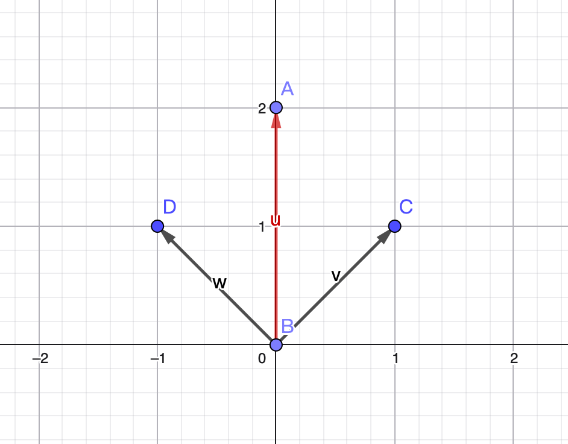
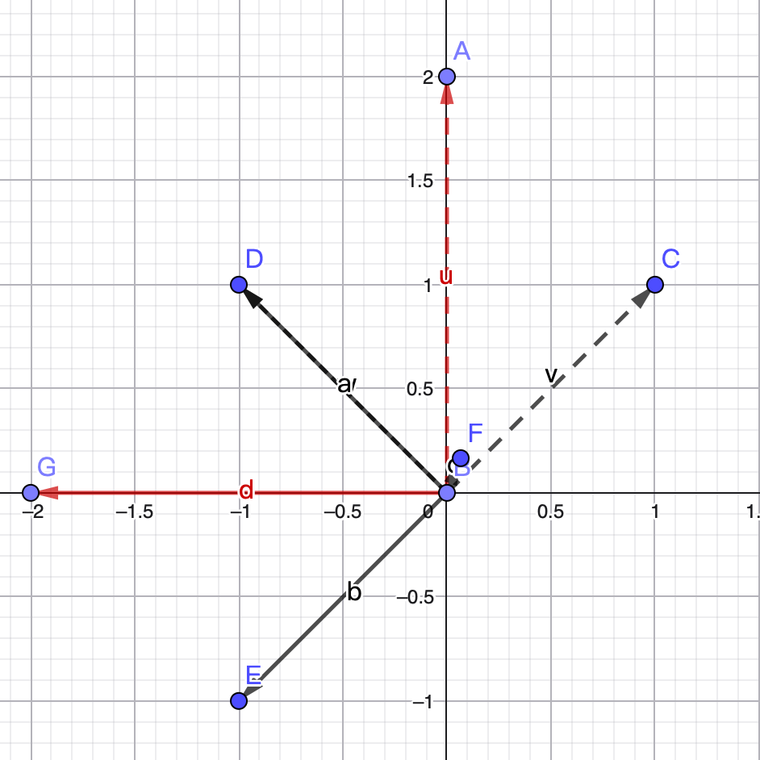

  SLAM理论学习

# 旋转平移矩阵

## 向量的表示方法（线性组合）

首先，向量的表示有三种方式：  
1. 带有箭头的有向线段。  
2. 符号表示，例如
   $$
   \vec{v}、\vec{x}
   $$
3. 矩阵列向量表示，例如  
$$
\vec{v} = \begin{bmatrix} v_1 \\ v_2 \end{bmatrix}
$$

以该为基础，进行具体的分析。在这个空间的任何一点(向量)，都可以由这组基以线性组合的方式得到。  

比如在二维的 XY 平面中，其实下面就是组基：  
$$
\vec{e}_1 = \begin{bmatrix} 1 \\ 0 \end{bmatrix}, \quad
\vec{e}_2 = \begin{bmatrix} 0 \\ 1 \end{bmatrix}
$$

而向量
$$
\vec{v} = \begin{bmatrix} v_1 \\ v_2 \end{bmatrix}
其实就是线性组合：
$$

$$
v_1 \vec{e}_1 + v_2 \vec{e}_2 = 
v_1 \begin{bmatrix} 1 \\ 0 \end{bmatrix} + 
v_2 \begin{bmatrix} 0 \\ 1 \end{bmatrix} = 
\begin{bmatrix} v_1 \\ v_2 \end{bmatrix}
$$

## 线性变换

> **线性变换**：如果矩阵 A 左乘一个向量 v ⃗  , 就说成矩阵 A 对向量 v 
>  进行了线性变换。直观上的感觉改变了向量 v ⃗的坐标。
>
> **矩阵乘法**的意义，其实就是将一个向量，经过某个矩阵(函数)之后，输出为另外一个向量，就是说，变换就意味则，将原来的向量变换到另外一个地方。而线性变换，也就是在变换的基础上，再加一个条件，线性的，也就是原来的一条直线，在变换了之后还应该是直线。

**核心思想：**任何一个空间向量的一点，都是由向量基线性变换而来。

**举例：**  假设存在一组基底
$$
\vec{e}_1 = \begin{bmatrix} 1 \\ 1 \end{bmatrix}, \quad
\vec{e}_2 = \begin{bmatrix} -1 \\ 1 \end{bmatrix}
$$
存在向量
$$
\vec{v} = 1\vec{e1}+1\vec{e2}=\begin{bmatrix} 0 \\ 2 \end{bmatrix}
$$
变换后的向量为
$$
\vec{v’} = A\vec{v}=\begin{bmatrix} 0&-1 \\ 1&0 \end{bmatrix} \begin{bmatrix}0\\2\end{bmatrix}= \begin{bmatrix}-2\\0\end{bmatrix}
$$

$$
A=\begin{bmatrix} 0&-1 \\ 1&0 \end{bmatrix}（逆时针旋转90度）
$$

$$
\color{blue}{
\vec{v}' 
= 1 \vec{e}_1' + 1 \vec{e}_2' 
= 1 (A \vec{e}_1) + 1 (A \vec{e}_2) 
= 1 \begin{bmatrix} 1 \\ -1 \end{bmatrix} 
+ 1 \begin{bmatrix} -1 \\ 1 \end{bmatrix} 
= \begin{bmatrix} -2 \\ 0 \end{bmatrix}
}
$$
变换作用在基底的时候，系数是不会发生改变，也就是这个向量关于基的线性组合方式是没有变化的，改变的是基底。

> 关注基底变化前后就能够掌握空间的变化

## 旋转矩阵（三维空间的旋转）

$$
\vec{a}' 
=  \begin{bmatrix} \vec{e1},\vec{e2},\vec{e3} \end{bmatrix}  \begin{bmatrix} a1\\a2\\a3 \end{bmatrix}
= a1\vec{e1}+a2\vec{e2}+a3\vec{e3}
$$

$$
（a_1,a_2,a_3)^T\\表示\vec{a}在此\vec{e}基坐标下的坐标
$$

运用到SLAM的运动上的时候，要完成一个坐标的变换。常见的运动时坐标转换是设定一个**世界坐标系**（惯性坐标系），以此为基准，例如图中的
$$
x_{\text{W}}, y_{\text{W}}, z_{\text{W}}
$$
 相机或机器人是一个移动坐标系, 例如图中 
$$
x_{\text{c}}, y_{\text{c}}, z_{\text{c}}
$$

在变化过程中，先得到该**p**点针对机器人坐标系的坐标值, 再根据机器人位姿变换到世界坐标系中。需要进行一个旋转变换，可以用一个矩阵 **T** 来描述它。

> 刚体运动：两个坐标系之间的运动由一个旋转加上一个平移组成, 这种运动称为刚体运动。
