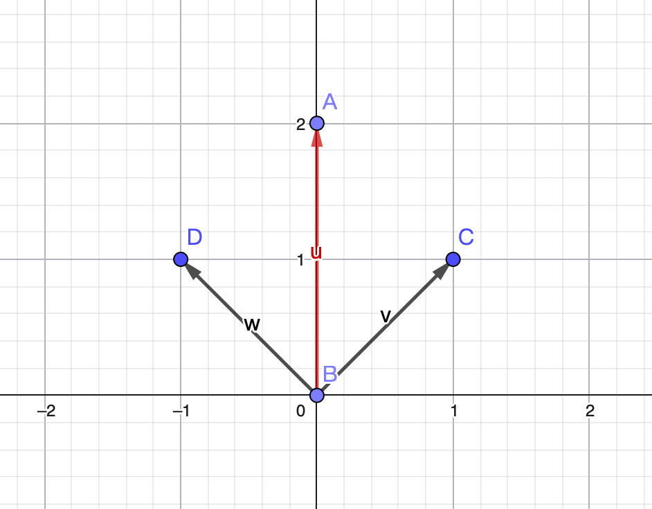
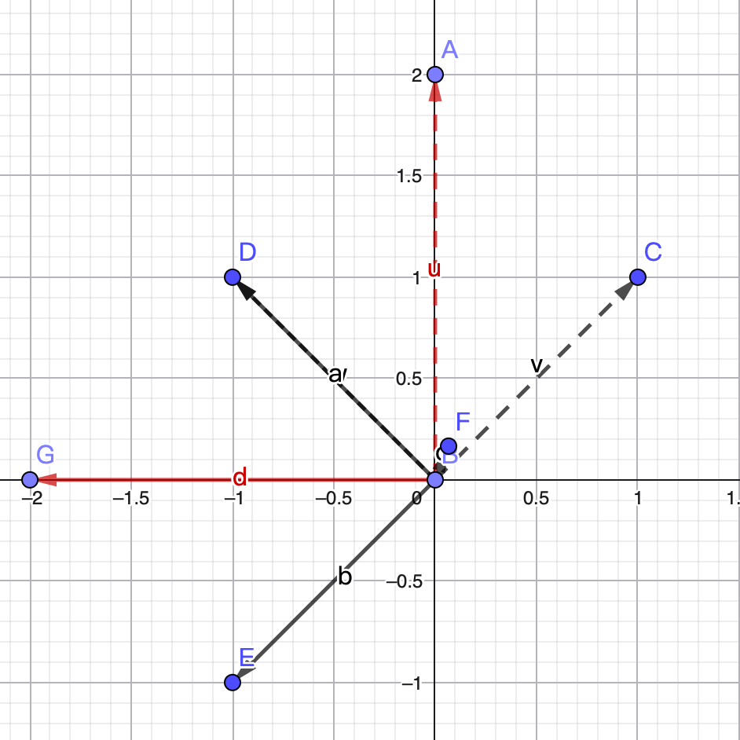
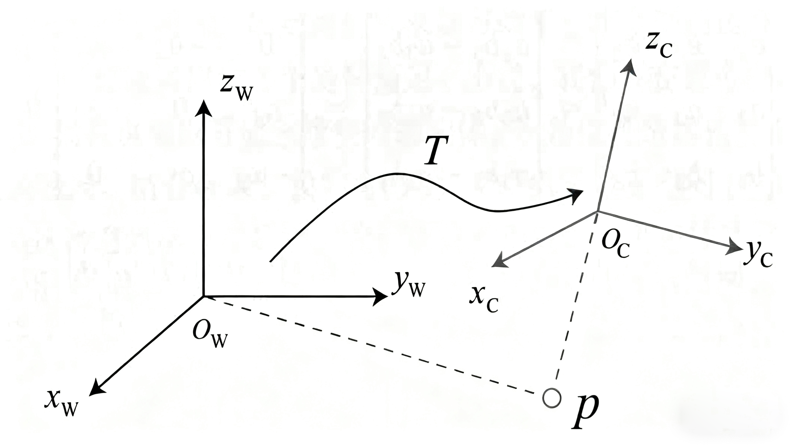

  SLAM理论学习

# 旋转平移矩阵

## 向量的表示方法（线性组合）

首先，向量的表示有三种方式：  
1. 带有箭头的有向线段。  
2. 符号表示，例如
   $$
   \vec{v}、\vec{x}
   $$
3. 矩阵列向量表示，例如  
$$
\vec{v} = \begin{bmatrix} v_1 \\ v_2 \end{bmatrix}
$$

以该为基础，进行具体的分析。在这个空间的任何一点(向量)，都可以由这组基以线性组合的方式得到。  

比如在二维的 XY 平面中，其实下面就是组基：  
$$
\vec{e}_1 = \begin{bmatrix} 1 \\ 0 \end{bmatrix}, \quad
\vec{e}_2 = \begin{bmatrix} 0 \\ 1 \end{bmatrix}
$$

而向量
$$
\vec{v} = \begin{bmatrix} v_1 \\ v_2 \end{bmatrix}
其实就是线性组合：
$$

$$
v_1 \vec{e}_1 + v_2 \vec{e}_2 = 
v_1 \begin{bmatrix} 1 \\ 0 \end{bmatrix} + 
v_2 \begin{bmatrix} 0 \\ 1 \end{bmatrix} = 
\begin{bmatrix} v_1 \\ v_2 \end{bmatrix}
$$

## 线性变换

> **线性变换**：如果矩阵 A 左乘一个向量 v ⃗  , 就说成矩阵 A 对向量 v 
>  进行了线性变换。直观上的感觉改变了向量 v ⃗的坐标。
>
> **矩阵乘法**的意义，其实就是将一个向量，经过某个矩阵(函数)之后，输出为另外一个向量，就是说，变换就意味则，将原来的向量变换到另外一个地方。而线性变换，也就是在变换的基础上，再加一个条件，线性的，也就是原来的一条直线，在变换了之后还应该是直线。

### **核心思想：**

任何一个空间向量的一点，都是由向量基线性变换而来。

### **举例：**  

**假设存在一组基底**
$$
\vec{e}_1 = \begin{bmatrix} 1 \\ 1 \end{bmatrix}, \quad
\vec{e}_2 = \begin{bmatrix} -1 \\ 1 \end{bmatrix}
$$
存在向量
$$
\vec{v} = 1\vec{e1}+1\vec{e2}=\begin{bmatrix} 0 \\ 2 \end{bmatrix}
$$
变换后的向量为
$$
\vec{v’} = A\vec{v}=\begin{bmatrix} 0&-1 \\ 1&0 \end{bmatrix} \begin{bmatrix}0\\2\end{bmatrix}= \begin{bmatrix}-2\\0\end{bmatrix}
$$

$$
A=\begin{bmatrix} 0&-1 \\ 1&0 \end{bmatrix}（逆时针旋转90度）
$$

$$
\color{blue}{
\vec{v}' 
= 1 \vec{e}_1' + 1 \vec{e}_2' 
= 1 (A \vec{e}_1) + 1 (A \vec{e}_2) 
= 1 \begin{bmatrix} 1 \\ -1 \end{bmatrix} 
+ 1 \begin{bmatrix} -1 \\ 1 \end{bmatrix} 
= \begin{bmatrix} -2 \\ 0 \end{bmatrix}
}
$$
变换作用在基底的时候，系数是不会发生改变，也就是这个向量关于基的线性组合方式是没有变化的，改变的是基底。

> 关注基底变化前后就能够掌握空间的变化

## 旋转矩阵（三维空间的旋转）

$$
\vec{a}' 
=  \begin{bmatrix} \vec{e1},\vec{e2},\vec{e3} \end{bmatrix}  \begin{bmatrix} a1\\a2\\a3 \end{bmatrix}
= a1\vec{e1}+a2\vec{e2}+a3\vec{e3}
$$

$$
（a_1,a_2,a_3)^T\\表示\vec{a}在此\vec{e}基坐标下的坐标
$$

运用到SLAM的运动上的时候，要完成一个坐标的变换。常见的运动时坐标转换是设定一个**世界坐标系**（惯性坐标系），以此为基准，例如图中的
$$
x_{\text{W}}, y_{\text{W}}, z_{\text{W}}
$$
 相机或机器人是一个移动坐标系, 例如图中 
$$
x_{\text{c}}, y_{\text{c}}, z_{\text{c}}
$$

在变化过程中，先得到该**p**点针对机器人/相机坐标系的坐标值, 再根据机器人位姿变换到世界坐标系中。需要进行一个旋转变换，可以用一个矩阵 **T** 来描述它。

> 刚体运动：两个坐标系之间的运动由一个旋转加上一个平移组成, 这种运动称为刚体运动。体运动过程中, 同一个向量在各个坐标系下的长度和夹角都不会发生变化。变化的仅仅是坐标系的位置。

### 欧式变换

> 欧式变换就是对不同坐标系的转换，欧氏变换由旋转和平移组成。

设某个单位正交基
$$
\begin{bmatrix}\vec{e1},\vec{e2},\vec{e3}
\end{bmatrix}经过一次旋转后变成了\begin{bmatrix}\vec{e1'},\vec{e2'},\vec{e3'}
\end{bmatrix},那么, 对于同一个向量\vec{a}，
$$

$$
它在两个坐标系下的坐标为 [ a 1 , a 2 , a 3 ]^T 和\left[a_{1}’, a_{2}’, a_{3}’\right]^{\mathrm{T}}，根据坐标的定义有
$$

$$
\begin{bmatrix} \vec{e1},\vec{e2},\vec{e3} \end{bmatrix}\begin{bmatrix} \vec{a1}\\
	\vec{a2} \\
	\vec{a3} \end{bmatrix}=\begin{bmatrix} \vec{e1'},\vec{e2'},\vec{e3'} \end{bmatrix}\begin{bmatrix} \vec{a1'}\\
	\vec{a2'} \\
	\vec{a3'} \end{bmatrix}
$$

左右两边同时左乘单位矢量
$$
\begin{bmatrix} \vec{e1}^T \\
\vec{e2}^T\\
\vec{e3}^T\\
\end{bmatrix}
$$
，所以下式：
$$
\begin{bmatrix}
a_1 \\
a_2 \\
a_3
\end{bmatrix}
=
\begin{bmatrix}
e_1^T e_1' & e_1^T e_2' & e_1^T e_3' \\
e_2^T e_1' & e_2^T e_2' & e_2^T e_3' \\
e_3^T e_1' & e_3^T e_2' & e_3^T e_3'
\end{bmatrix}
\begin{bmatrix}
a_1' \\
a_2' \\
a_3'
\end{bmatrix}
\quad =\quad R \vec{a}
$$

我们把中间的矩阵拿出来，定义一个矩阵 \( R \)。这个矩阵由两个基之间的内积组成，刻画了旋转前后一个向量的坐标变换关系。只要旋转是一样的，这个矩阵就是一样的。可以说，矩阵 \( R \) 描述了旋转本身。因此，旋转矩阵 \( R \) 可以用来将一个坐标系的向量表示转换到另一个坐标系。

>  欧式变换中的旋转矩阵是一个行列式为 1 的正交矩阵，反之, 行列式 为 1 的正交矩阵也是一个旋转矩阵

$$
\color{blue}SO(n) = { R ∈ R^n×n | RR^T = E, det(R) = 1 }
$$

SO(n) 是特殊正交群。这个集合由 n 维空间的旋转矩阵组成，特别地，SO(3) 就是指三维空间的旋转。通过旋转矩阵，我们可以直接讨论两个坐标系之间的旋转变换，而不用再从基向量平移谈起。由于旋转矩阵为正交矩阵，它的逆（即转置）描述了一个相反的旋转。按照上面的定义方式，有：
$$
\color{red}\vec{a}' = R^{-1} \vec{a} = R^T \vec{a}
$$
显然 RT表示一个相反的旋转（正交矩阵性质）

## 矩阵平移

欧氏变换中, 除了旋转还有平移。考虑世界坐标系中的向量 a ⃗ ， 经过一次旋转(用 R描述)和一次平移 t 后, 得到了 a‘ ⃗   , 那么把旋转和平移合到一起, 有
$$
\vec{a'}=R\vec{a}+t
$$
*t* 称为平移向量。相比于旋转, 平移部分只需把平移向量加到旋转之后的坐标上。
$$
a1=R_\text{12}a_\text{2}+t_\text{12}
$$
**R12 是指 “把坐标系 2 的向量变换到坐标系 1" 中，t12表示“从 1 到 2 的向量”，**在坐标系 1 下取的坐标**。

## 欧式变换与齐次坐标

式 (22) 完整地表达了欧氏空间的旋转与平移，不过还存在在一个小问题：这里的变换关系不是一个线性关系。假设我们进行了两次变换
$$
( R_1, t_1 ) 和 ( R_2, t_2 )：

[
\mathbf{b} = R_1 \mathbf{a} + t_1, \quad \mathbf{c} = R_2 \mathbf{b} + t_2 
]
$$

$$
那么，从 ( \mathbf{a} ) 到 ( \mathbf{c} ) 的变换为：

[
\mathbf{c} = R_2 ( R_1 \mathbf{a} + t_1 ) + t_2
]
$$

引入齐次坐标后，得到
$$
\begin{bmatrix}
\vec{a'} \\
1
\end{bmatrix}
=
\begin{bmatrix}
R & t \\
0^T & 1
\end{bmatrix}
\begin{bmatrix}
\vec{a} \\
1
\end{bmatrix}
 \quad = \quad 
T\begin{bmatrix}
\vec{a} \\
1
\end{bmatrix}
$$
在一个三维向量的末尾添加 1, 将其变成了四维向量, 称为齐次坐 标。对于这个四维向量, 我们可以把旋转和平移写在一个矩阵里, 使得整个关系变成线性关系。 该式中, 矩阵 Tspan>称为变换矩阵

